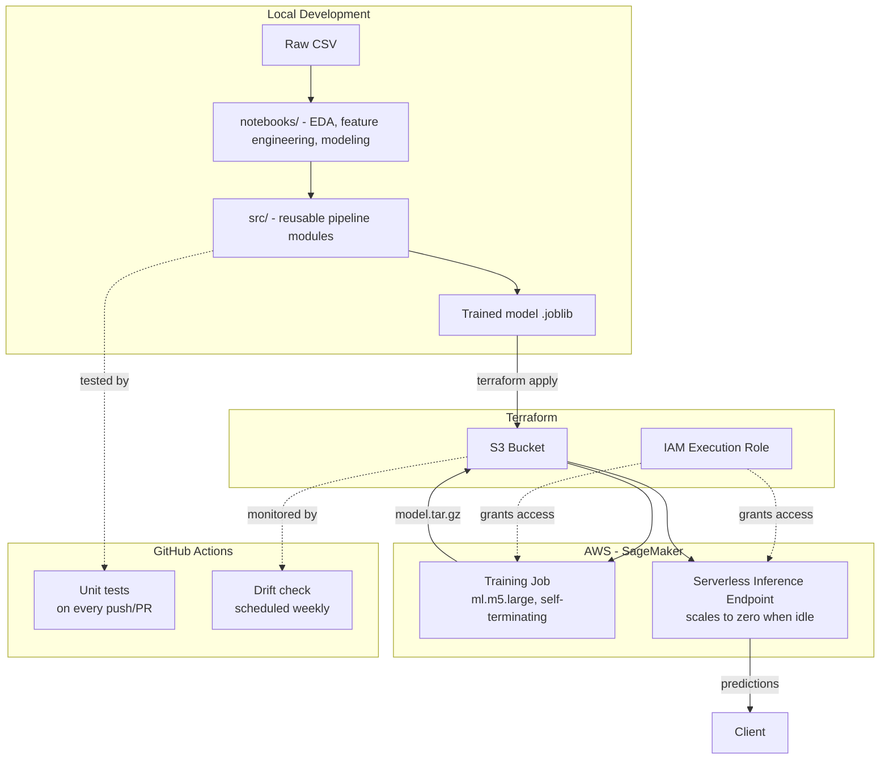

# Telco Customer Churn — End-to-End MLOps Pipeline


A complete machine learning project that predicts telecom customer churn —
from raw data exploration through a model trained and deployed on real AWS
infrastructure, provisioned entirely as code, with automated testing and
data drift monitoring.

Built as a hands-on study project for the **AWS Certified Machine Learning
Engineer – Associate (MLA-C01)** exam, and as a portfolio piece demonstrating
practical MLOps skills beyond notebook-only data science.

## The Problem

Predict which telecom customers are likely to cancel their service, using
the [Telco Customer Churn dataset](https://www.kaggle.com/datasets/blastchar/telco-customer-churn)
(7,043 customers, 21 features). A binary classification problem with
moderate class imbalance (~26.5% churn rate).

## Architecture



## Results

| Model | Precision | Recall | F1 | ROC-AUC |
|---|---|---|---|---|
| Logistic Regression (baseline) | 0.658 | 0.567 | 0.609 | 0.842 |
| Random Forest (default) | 0.637 | 0.511 | 0.567 | 0.826 |
| Random Forest (tuned, RandomizedSearchCV) | 0.671 | 0.513 | 0.582 | **0.844** |

**Key finding:** contract type is the single strongest churn signal —
month-to-month customers churn at **42.7%**, versus **2.8%** for two-year
contracts, a 15x difference confirmed both through EDA and the final model's
feature importances.

## Repository Structure

```
├── data/                  # Raw dataset (gitignored, provisioned via Terraform to S3)
├── notebooks/             # 01-08: EDA through model persistence, each self-explanatory
├── src/                   # Reusable pipeline: data.py, features.py, train.py,
│                          # pipeline.py, monitoring.py, generate_baseline.py, check_drift.py
├── sagemaker_job/         # AWS training & deployment: entry_point.py (runs in-container),
│                          # launch_training_job.py, deploy_endpoint.py, inference.py,
│                          # invoke_endpoint.py, delete_endpoint.py
├── terraform/             # Infrastructure as code: S3 bucket, IAM role, bucket contents
├── tests/                 # pytest unit tests for src/
├── monitoring/            # Saved drift-detection baseline (generated, not hand-written)
└── .github/workflows/     # CI: tests on every push, drift check on a weekly schedule
```

## Running It Locally

```bash
python -m venv venv
source venv/bin/activate
pip install pandas scikit-learn matplotlib seaborn jupyterlab joblib pytest

# Full pipeline: raw CSV in, trained model out
python -m src.pipeline

# Run the test suite
pytest tests/ -v
```

## Running It On AWS

Provisions an S3 bucket, an IAM role scoped to that bucket, and uploads the
data/model as code-managed S3 objects:

```bash
cd terraform
terraform init
terraform plan   # always review before applying
terraform apply
```

Train the model on a managed, self-terminating SageMaker instance (billed
only for the ~5-10 minutes it actually runs):

```bash
python -m sagemaker_job.launch_training_job \
    --role-arn <sagemaker_execution_role_arn from terraform output> \
    --bucket <bucket_name from terraform output>
```

Deploy behind a **serverless** inference endpoint — scales to zero when
idle, so there's no 24/7 billing risk from a forgotten always-on endpoint:

```bash
python -m sagemaker_job.deploy_endpoint \
    --role-arn <role-arn> --bucket <bucket> --model-s3-uri <model.tar.gz S3 path>

python -m sagemaker_job.invoke_endpoint --endpoint-name <name>

# Tear down when done - a serverless endpoint costs nothing idle, but this
# keeps the account tidy
python -m sagemaker_job.delete_endpoint --resource-name <name>
```

## Testing & CI

- **Unit tests** (`tests/`) cover the core data cleaning, feature
  engineering, and drift-detection logic, run automatically on every push
  and pull request via GitHub Actions.
- **Data drift monitoring** (`src/monitoring.py`) uses the Population
  Stability Index (PSI) — the same statistic AWS's own SageMaker Model
  Monitor is built around — to detect when new data has statistically
  diverged from the data the model was trained on. Runs on a weekly
  schedule via GitHub Actions, entirely free (no SageMaker Model Monitor
  infrastructure required for a project at this scale).

## Notable Real-World Problems Solved Along the Way

This project hit several genuine obstacles worth documenting, since working
through them is a large part of what real ML engineering looks like:

- **A hidden data quality bug** — `TotalCharges` stored blank values as
  whitespace strings rather than proper `NaN`, invisible to a standard
  `.isnull()` check, traced to brand-new customers with zero tenure.
- **A major SageMaker SDK version change (v2 → v3)** mid-project, which
  removed the framework-specific `Estimator` classes entirely in favor of a
  unified `ModelTrainer` API — required rebuilding the training launcher
  against undocumented-at-the-time changes.
- **AWS Service Quotas defaulting to zero** for training instances on a new
  account — a deliberate cost-control safeguard, not a bug, but one that
  blocks any training job until explicitly raised.
- **A pandas version mismatch** between the local dev environment and the
  older SageMaker training container, causing a dtype-handling crash that
  didn't reproduce locally.
- **Choosing serverless over real-time inference** deliberately, to avoid
  the always-on billing risk that catches a lot of first-time SageMaker
  users off guard.

## Tech Stack

Python · pandas · scikit-learn · Jupyter · Terraform · AWS (S3, IAM,
SageMaker Training Jobs, SageMaker Serverless Inference) · pytest · GitHub
Actions

## Exam Alignment (MLA-C01)

| Domain | Where it's covered |
|---|---|
| Data Preparation for ML | Notebooks 01–04: data quality investigation, imputation strategy, encoding |
| ML Model Development | Notebooks 05–08: train/test methodology, metric selection under class imbalance, cross-validated hyperparameter tuning |
| Deployment & Orchestration | `terraform/`, `sagemaker_job/`: IaC, IAM least-privilege, managed training jobs, serverless inference |
| Monitoring, Maintenance & Security | `.github/workflows/`, `src/monitoring.py`: automated testing, PSI-based drift detection, scoped IAM permissions, encrypted/private S3 storage |
